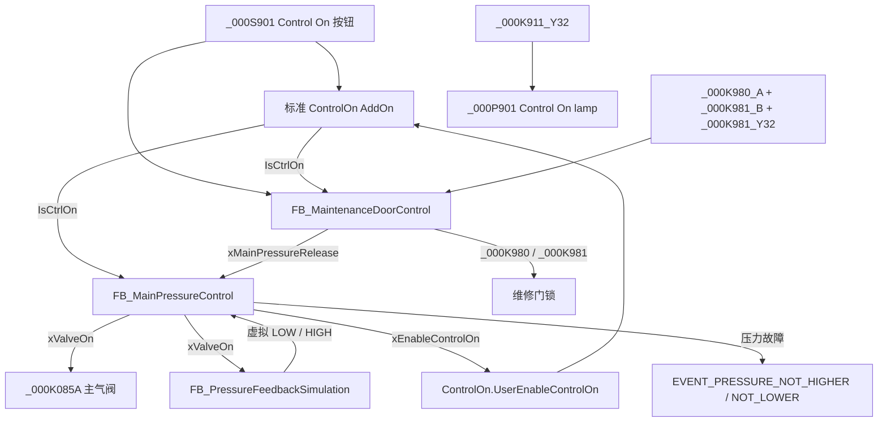

# Control On 与主气压控制关系

## 受控版本

| FB | 版本 |
|---|---:|
| `FB_OperatorButton` | V1.0.0 |
| `FB_MainPressureControl` | V1.0.0 |
| `FB_MaintenanceDoorControl` | V1.0.0 |
| `FB_PressureFeedbackSimulation` | V1.0.0 |

版本号写在各 FB 的 PLE Declaration 中，同时由 `src/plc/common/` 保留可读源。

## 当前调用关系



`StationUnit.OnCall` 每个扫描周期按“维修门控制 → 虚拟反馈 → 主气压控制”调用。虚拟反馈读取的是主压力 FB 上一个扫描周期形成的最终阀命令；这一扫描周期差远小于 1 s 延时，不影响诊断。

## OpCon Plus ControlOn 的释放模型

本项目确认采用 OpCon Plus 的标准故障传播方式。`_000K911` 是持续的 Control On/安全回路释放输出，`_000K951` 是限时的 Switch Control On 脉冲，`_000K911_Y32` 是电气实际反馈。应用代码不得直接抢写 `_000K911` 或 `_000K951`。

标准 `ControlOn` AddOn 自身会检查配置的 BusMaster、Control Off 和 `ParImm.UserEnableControlOn` 等条件。在 Station010 集成层，Unit/Peripheral 的故障或未就绪状态还会经 OpCon 的 Unit → Command Handler → Mode Handler/Station 聚合，使 Station/应用释放不成立；在本项目中最终体现为 `UserEnableControlOn` 不成立，Control On 因而不能建立或被撤销。本项目主气压故障也通过同一正式接口 `Station.ControlOn.ParImm.UserEnableControlOn` 主动撤销允许条件。因此，现场出现“某设备通讯恢复后 `_000K911` 才正常输出”属于这个设计链条，而不是 `_000K911` 与该设备被应用代码直接硬接。

## 正常上电时序

1. 操作者按 `_000S901`。
2. 维修门 FB 给 `_000K980`、`_000K981` 上电，并检查 `_000K980_A`、`_000K981_B` 和 `_000K981_Y32`。
3. 标准 ControlOn AddOn 在电气安全回路正常后形成 `IsCtrlOn`；物理灯 `_000P901` 当前跟随 `_000K911_Y32`。
4. 只有 `IsCtrlOn=TRUE`、维修门释放成立、虚拟反馈为“仅 LOW”且没有压力故障时，主压力 FB 才令 `_000K085A=TRUE`。
5. `_000K085A` 命令成立 1 s 后，虚拟反馈切为 `LOW=FALSE / HIGH=TRUE`，形成 `xPressureReady`。
6. 若阀开启后 5 s 内没有“仅 HIGH”，触发 `EVENT_PRESSURE_NOT_HIGHER`；若阀关闭后 5 s 内没有“仅 LOW”，触发 `EVENT_PRESSURE_NOT_LOWER`。
7. 任一压力故障令 `UserEnableControlOn=FALSE`，标准 AddOn 随即撤销 Control On；应用代码不直接抢写 `_000K911`。

## 2026-08-24 故障原因与修复

旧实现让虚拟反馈直接跟随 `ControlOn.OutImm.IsCtrlOn`。当 Control On 已成立、但维修门或安全继电器尚未让主阀放行时，虚拟反馈仍会在 1 s 后提前变成 HIGH。主阀此时保持 OFF，而主压力 FB 又只允许从“仅 LOW”状态开启，因此形成死锁：

```text
Control On = TRUE
  → 1 s 后虚拟 HIGH
  → 主阀仍 OFF 且已失去 LOW 开阀条件
  → 阀 OFF / 非 LOW 持续 5 s
  → EVENT_PRESSURE_NOT_LOWER
  → UserEnableControlOn = FALSE
  → Control On 自动下电
```

修复后，虚拟反馈只跟随最终阀命令 `Station.MainPressureControl.xValveOn`。维修门联锁未满足时，阀保持 OFF、虚拟反馈也保持 LOW；联锁满足并真正发出阀命令后才延时切 HIGH。Control Off 或联锁撤销使阀关闭，1 s 后虚拟反馈切 LOW，早于 5 s 低压诊断，因此不会再产生该条假报警。

本逻辑不替代安全继电器或安全 PLC。实体设备下载与时序验收仍需用户单独批准。
